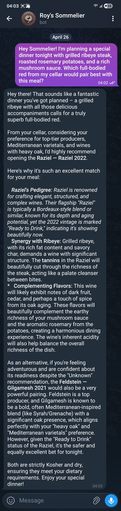
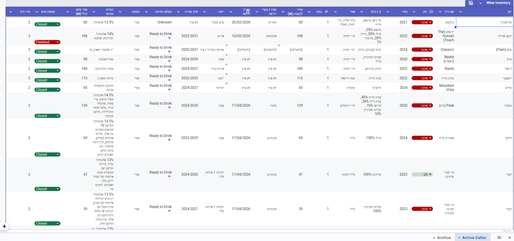

# 🍷 Gemini Wine Sommelier

[](https://python.org)
[](https://ai.google.dev/)
[](https://core.telegram.org/bots)
[](https://vercel.com)

> *"A professional sommelier in your pocket, intimately familiar with your personal wine cellar."*

💬 **Need Help Setting This Up?**
Feel free to open an issue on **[GitHub](https://github.com/Royc4515)** or connect with me on **[LinkedIn](https://www.linkedin.com/in/roy-carmelli/)**.

**Gemini Wine Sommelier** is a serverless Telegram bot powered by the Google Gemini API. It acts as a personal, expert Sommelier that perfectly pairs food with your *actual* wine inventory, managed live via Google Sheets.

Whether you're looking to open a top-tier Bordeaux, pair a heavy Syrah with a steak, or just do some cellar management, the bot can be completely customized to understand your specific taste profile, dietary restrictions, and preferred language to recommend exactly what to pour next.

---

## 📸 Screenshots

### The Sommelier in Action
*(The bot providing a perfect pairing recommendation based on your active inventory)*


### The Cellar (Google Sheets)
*(Your personal cellar managed directly from Google Sheets — always synced and up-to-date)*


---

## ✨ Key Features

- **🧠 Advanced Gemini Intelligence**: Leverages the latest `google-genai` SDK with a robust model fallback chain (including `gemini-3.1-flash-lite`, `gemma-4-31b`, `gemini-2.5-flash`) and exponential backoff for a bulletproof experience.
- **📊 Live Google Sheets Sync**: Connects directly to your Google Sheet to read real-time inventory. It knows exactly what bottles are "Open", "Closed", or "Reserved" and prioritizes open bottles.
- **🍷 Fully Customizable Persona**: By default, the bot is a highly knowledgeable Sommelier. However, you can easily tweak its system prompt to match your specific needs (e.g., specific regions, dietary restrictions like Kosher/Vegan, preferred language, or conversational tone).
- **☁️ Serverless Architecture**: Fully serverless backend using Vercel Serverless Functions and Telegram Webhooks. No active polling server required!

---

## 🏗 Architecture & Tech Stack

- **Language**: Python 3.9+
- **AI Integration**: `google-genai` SDK
- **Data Layer**: `gspread` & `google-auth` (Google Sheets API)
- **Messaging**: `python-telegram-bot`
- **Deployment**: Vercel Serverless Functions

---

## 🚀 Setup & Local Development

### 1. Prerequisites
- A Telegram Bot Token (from [@BotFather](https://t.me/botfather))
- A Google Cloud Service Account JSON file (with Google Sheets API enabled)
- A Google Gemini API Key
- A Google Sheet formatted for your inventory

### 2. Clone & Install
```bash
git clone https://github.com/Royc4515/gemini-wine-sommelier.git
cd gemini-wine-sommelier
pip install -r requirements.txt
```

### 3. Environment Variables
Create a `.env.local` file in the root directory:
```env
TELEGRAM_TOKEN=your_telegram_bot_token
GEMINI_API_KEY=your_gemini_api_key
GOOGLE_SHEET_URL=your_google_sheet_url
GOOGLE_SERVICE_ACCOUNT_JSON={"type": "service_account", ...}
```

### 4. Running Tests
The project uses Python's built-in `unittest` framework with full API mocking to ensure reliability across all API boundaries.
```bash
python -m unittest discover tests/
```

### 5. Customizing Your Sommelier (Persona & Language)
You can make the bot speak any language or follow specific dietary/wine restrictions (e.g., French only, Natural wines, Kosher wines, etc.). 
Simply edit the `SYSTEM_INSTRUCTION` variable inside `sommelier_ai.py` to shape your perfect Sommelier!

---

## 💬 Need Help?

Building your own virtual Sommelier can be tricky! If you need any help connecting to Google Sheets, configuring the Vercel deployment, or tweaking the Gemini persona, I'm here to help.

You can open an issue here on **[GitHub](https://github.com/Royc4515)** or connect with me on **[LinkedIn](https://www.linkedin.com/in/roy-carmelli/)**.

---

*Cheers!* 🍷
