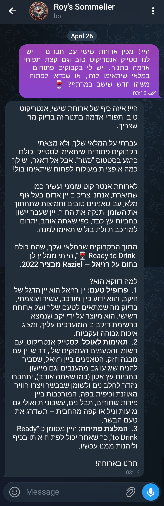
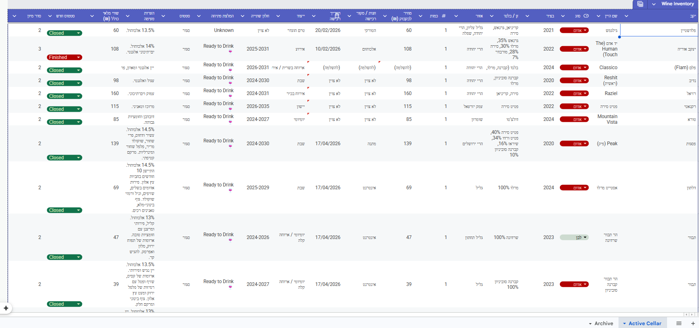

# 🍷 Gemini Sommelier Bot

[](https://python.org)
[](https://ai.google.dev/)
[](https://core.telegram.org/bots)
[](https://vercel.com)
[](https://www.linkedin.com/in/roy-carmelli/)
[](https://github.com/Royc4515)

**Gemini Sommelier Bot** is a serverless Telegram bot powered by the Google Gemini API. It operates as a highly specialized, context-aware sommelier that pairs meal selections with your live wine inventory managed via Google Sheets.

Designed for robust execution, it utilizes a Vercel-deployed serverless architecture, exponential backoff for API resiliency, and a dynamic LLM fallback chain.

---

## 📸 Interface & Data State

| **Telegram Interface (LLM Pairing)** | **Google Sheets (Live Inventory)** |
|:---:|:---:|
|  |  |
| *Context-aware recommendations based on available bottles.* | *Source of truth for cellar management and status tracking.* |

---

## ✨ Key Features

- **Serverless Execution**: Deployed on Vercel Serverless Functions via Telegram Webhooks. No active polling or persistent compute.
- **Dynamic Inventory Sync**: Live queries to Google Sheets. Explicitly respects "Open" vs. "Closed" bottle statuses for routing recommendations.
- **Wine Auto-Ingestion (`/addwine`)**: Add bottles by sending front + back label photos (fused in one multimodal call) or a free-text description of one or more wines. The bot extracts the data, shows a confirmation with inline buttons, and on approval appends one row per wine to the cellar.
- **Resilient AI Pipeline**: Integrates the `google-genai` SDK with an automatic fallback chain (`gemini-3.1-flash-lite` → `gemma-4-31b` → `gemini-2.5-flash`) and exponential backoff to mitigate transient API errors.
- **Modular Persona Configuration**: The sommelier's language, dietary constraints, and domain expertise are strictly configurable via the system instructions within `sommelier_ai.py`.

---

## 🍷 Adding Wines (`/addwine`)

`/addwine` starts a short stateful conversation:

1. `/addwine` - the bot asks for a front photo or a text description.
2. **Photo path**: send the front label, then the back label. The bot downloads both and reads them in a single multimodal call.
3. **Text path**: send a description instead (e.g. "Flam Classico 2021, Judean Hills, 14%"). One message may list several wines.
4. The bot shows a confirmation with the parsed label facts, its own reasoned suggestions (purpose, opening recommendation, drinking window, an expected tasting profile), the still-blank manual fields (price / store), and `✅ אישור` / `❌ ביטול` buttons.
5. Reply with a forgiving line to edit any field before writing, e.g. `מחיר: 69, חנות: אינטרנט, ייעוד: שבת, חלון שתייה: 2027-2032`. For multiple wines, prefix an index: `2: מחיר 80`.
6. Tap **אישור** to append. `/cancel` aborts at any point.

The bot reasons about `ייעוד` (best use/occasion), `המלצת פתיחה` (ready now vs hold-until-year, by vintage and the grape/region/producer's aging potential), and `חלון שתייה` (optimal drinking-year range). The `הערות טעימה` it writes are an *expected* profile (an educated prediction, since the bottle is unopened), folded together with the factual label data - all editable before writing.

The bot writes only columns A-N. Columns O/P/Q (inventory value formula, status, sort) are managed manually.

> **Write mechanism / no second auth path.** The bot reads the cellar via a public CSV export URL and has no writable Google client. Writes (and the `/addwine` conversation state) go through the **same Apps Script Web App** already used for chat memory (`SHEETS_MEMORY_URL`), which executes as the sheet owner. After editing `apps_script.js`, paste it into the bound script (Extensions → Apps Script), confirm `CELLAR_FILE_ID`, and **redeploy the existing Web App version** so the URL stays the same.
>
> **Column O edge case.** If column O holds per-row `=G*H` formulas, a newly appended row leaves O blank. Convert O to a single `ARRAYFORMULA` at the header so new rows auto-compute. The `inspect_o` action in the Apps Script reports which style is in use; `ping_write` verifies Editor access with a self-cleaning test write.

---

## 🏗 Architecture & Data Flow

The system employs a stateless, event-driven architecture designed for high availability:

1. **Webhook Trigger**: A user sends a message via Telegram. Telegram fires an HTTP POST request to the Vercel Serverless Function endpoint (`api/index.py`).
2. **State Retrieval**: The function synchronously fetches the latest cellar state directly from the configured Google Sheet via `urllib` and `csv` to minimize deployment payload size.
3. **Context Assembly**: The user's query and the parsed inventory state are compiled into a unified context window.
4. **Model Inference**: The request is routed to the Google Gemini API. If the primary model encounters a quota constraint or transient failure (e.g., `429 Too Many Requests`), the system automatically retries and gracefully degrades through the predefined fallback chain.
5. **Response Dispatch**: The generated pairing recommendation is securely returned to the user via the Telegram Bot API.

---

## 🚀 Setup & Local Development

### 1. Prerequisites
- A Telegram Bot Token (from [@BotFather](https://t.me/botfather))
- A Google Cloud Service Account JSON file (with Google Sheets API enabled)
- A Google Gemini API Key
- A Google Sheet formatted for your inventory

### 2. Clone & Install
```bash
git clone https://github.com/Royc4515/gemini-wine-sommelier.git
cd gemini-wine-sommelier
pip install -r requirements.txt
```

### 3. Environment Variables
Create a `.env.local` file in the root directory:
```env
TELEGRAM_TOKEN=your_telegram_bot_token
GEMINI_API_KEY=your_gemini_api_key
GOOGLE_SHEET_URL=your_google_sheet_url
GOOGLE_SERVICE_ACCOUNT_JSON={"type": "service_account", ...}
```

### 4. Running Tests
The project uses Python's built-in `unittest` framework with full API mocking to ensure reliability across all API boundaries.
```bash
python -m unittest discover tests/
```

### 5. Customizing Your Sommelier (Persona & Language)
You can make the bot speak any language or follow specific dietary/wine restrictions (e.g., French only, Natural wines, Kosher wines, etc.). 
Simply edit the `SYSTEM_INSTRUCTION` variable inside `sommelier_ai.py` to shape your perfect Sommelier!

---

## 💬 Need Help?

Building your own virtual Sommelier can be tricky! If you need any help connecting to Google Sheets, configuring the Vercel deployment, or tweaking the Gemini persona, I'm here to help.

You can open an issue here on **[GitHub](https://github.com/Royc4515)** or connect with me on **[LinkedIn](https://www.linkedin.com/in/roy-carmelli/)**.

---

*Cheers!* 🍷
